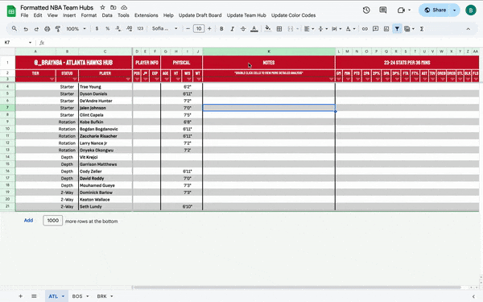

# NBA-Team-Stat-Collector
A Google Apps Script program that populates a Google Sheet with up-to-date NBA Team Data by web scraping RealGM

## Features:
- Collects jersey number, height, and weight from RealGM's player database
- Calculates age using birthdate
- Converts traditional per game statistics to per 36 minutes statistics and color codes them in comparison to the rest of the players
- Allows you to reassign and keep the position you feel is most accurate for the player

## Setup:
1) make a copy of the linked [formatted sheet](https://docs.google.com/spreadsheets/d/1ouSBe8PvJYHmqyh3ZOPua60CSolAA4mXcrNSELgLVPo/edit?usp=sharing)
2) select extensions in the menu above the sheet
3) select Apps Script
4) upload the [code.js](https://github.com/braydentodd/NBA-Team-Stat-Collector/blob/main/code.js) file
5) run it

## The process:
1) type the players' names in the C column and links to the players' RealGM profile page in the AB column
3) run the "Update Team" function that is created when the script is ran for the first time
4) run the "Update Color Codes" function that is created when the script is ran for the first time

